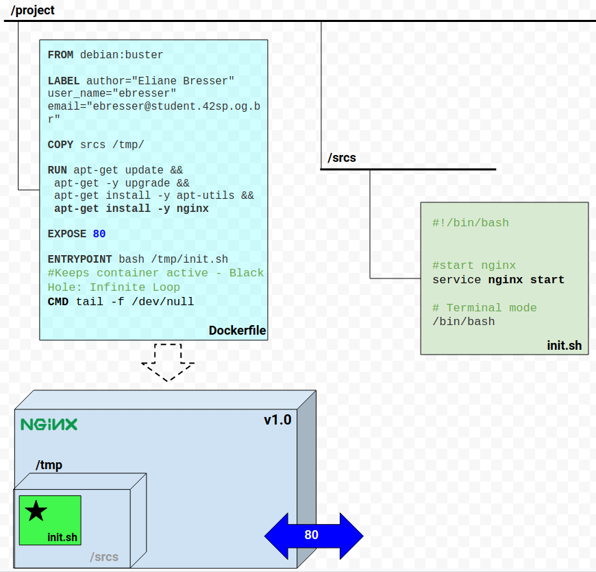

# 42ft_server

<h2>Step 1 - NGINX</h2>

Install **NGINX server**, start it and keep the container running.

<b>To keep container running:</b>
_In Unix-type operating systems, the / dev / null, or null device, is a special file that discards all information written in it and that does not return any information to a process that reads it (more precisely, it returns an end of archive). In Unix programming jargon, it's also called a bit bucket or "black hole"._ [See](https://pt.wikipedia.org/wiki/Dispositivo_nulo)

* <b>Build:</b> 
  * $ sudo docker image build -t lilangbr/ft_server:1.0 .
* <b>Up:</b>    
  * $ sudo docker container run -it -p 80:80 --name v1.0 lilangbr/ft_server:1.0

 
  
* <b>Stop:</b>    
  * $ sudo docker container stop v1.0
* <b>Start again:</b>    
  * $ sudo docker container start -ai v1.0 
  
<h2>Step 2 - SSL</h2> 

Configure nginx <b>HTTPS</b> server with self-signed <b>SSL certificate</b>.
* Two <b>new files</b>: config.sh and nginx.conf. 
  * The first copies the second, which is an additional configuration file, to the folder specified in the container, makes the necessary links, as well as configuring the SSL certificate with OpenSSL installed by Dockerfile. 
  * In the second, additional configuration file, the connection to port 80 is redirected to a secure HTTPS connection - port 443, which is added, setting the certificate as well as the index files.
    

* <b>Build:</b> 
  * $ sudo docker image build -t lilangbr/ft_server:1.1 .
* <b>Up:</b>    
  * $ sudo docker container run -it -p 80:80 -p 443:443 --name v1.1 lilangbr/ft_server:1.1
* <b>To stop and start again, see Step 1.</b>
