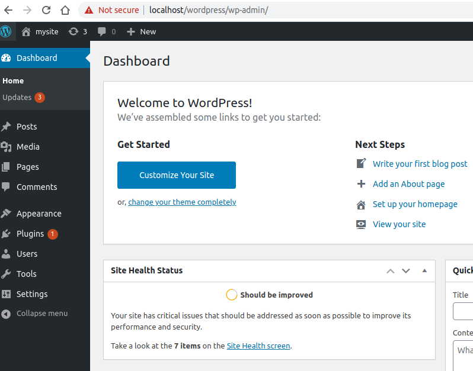

# 42ft_server

This is a System Administration subject, to discover Docker and set up my first web server! 

<h3>This server runs multiples services: </h3>

* **Wordpress**, 
* **phpMyAdmin**, and a 
* **SQL database**

• It was set up a web server with **Nginx**, in only one debian buster docker container. 

• Ther web server is be able to run several services at the same time: WordPress website, phpMyAdmin and MySQL. (It was make sure that the SQL database works with the WordPress and phpMyAdmin.)

• The server is be able to use the SSL protocol.

• Depending on the url, the server redirects to the correct website.

• Ther server is running with an autoindex that is be able to be disabled.

**Enjoy this!**

In order you understand how the server was contructed, below it was the steps of this project: 
(The intermediate files can be obtained by looking for commits)

<h2>Step 1 - NGINX v1.0</h2>

Install **NGINX server**, start it and keep the container running.

<b>To keep container running:</b>
_In Unix-type operating systems, the / dev / null, or null device, is a special file that discards all information written in it and that does not return any information to a process that reads it (more precisely, it returns an end of archive). In Unix programming jargon, it's also called a bit bucket or "black hole"._ [See](https://pt.wikipedia.org/wiki/Dispositivo_nulo)

* <b>Build:</b> 
  * $ sudo docker image build -t lilangbr/ft_server:1.0 .
* <b>Up:</b>    
  * $ sudo docker container run -it -p 80:80 --name v1.0 lilangbr/ft_server:1.0

 
  
* <b>Stop:</b>    
  * $ sudo docker container stop v1.0
* <b>Start again:</b>    
  * $ sudo docker container start -ai v1.0 
  
<h2>Step 2 - SSL v1.1</h2>

Configure nginx <b>HTTPS</b> server with self-signed <b>SSL certificate</b>.
* Three <b>new files</b>: config.sh, nginx.conf and self-signed.conf
  * The first copies the others, which are additional configuration files, to the folders specified in the container, makes the necessary links, as well as creates a self-signed key and certificate pair with OpenSSL installed by Dockerfile(#SSL config).
  * In the second, additional configuration file, the connection to port 80 is redirected to a secure HTTPS connection - port 443, which is added, setting the certificate, including the self-signed.conf file, as well as the index files.
    

* <b>Build:</b> 
  * $ sudo docker image build -t lilangbr/ft_server:1.1 .
* <b>Up:</b>    
  * $ sudo docker container run -it -p 80:80 -p 443:443 --name v1.1 lilangbr/ft_server:1.1
* <b>To stop and start again, see Step 1.</b>
<h2>Step 3 - MySQL v1.2</h2>

Install **MariaDB Server**, start it and test an exampledb and a exampleuser.

* <b>Modified files:</b>

* <b>Schema:</b>

* <b>Start</b>

* <b>Test</b>

* <b>Exit</b>

* <b> ***** All right! ***** </b>

* <b>Build:</b> 
  * $ sudo docker image build -t lilangbr/ft_server:1.2 .
* <b>Up:</b>    
  * $ sudo docker container run -it -p 80:80 -p 443:443 --name v1.2 lilangbr/ft_server:1.2
* <b>Stop:</b>    
  * $ sudo docker container stop v1.2
* <b>Start again:</b>    
  * $ sudo docker container start -ai v1.2 
 
 <h2>Step 4 - PHP v1.3</h2> 

Install **PHP** for processing. Need PHP fastCGI process manager to handle PHP requests. It's also necessary a module that allows PHP to communicat wiht MySQL.

* <b>Schema:</b>

* <b>Test 1: Passed!</b>

* <b>Test 2: Passed!</b>

* <b>Test 3: Passed!</b>

* <b> ***** All right! ***** </b>

* <b>Build:</b> 
  * $ sudo docker image build -t lilangbr/ft_server:1.3 .
* <b>Up:</b>    
  * $ sudo docker container run -it -p 80:80 -p 443:443 --name v1.3 lilangbr/ft_server:1.3
* <b>Stop:</b>    
  * $ sudo docker container stop v1.3
* <b>Start again:</b>    
  * $ sudo docker container start -ai v1.3 
  
<h2>Step 4* - More Tests</h2>

Here, let's test the **Database connection from PHP**. In config file, a database with some entries was created and also it was created a test file named todo_list.php to show in browser. As it was expected, the PHP was connected with database! In figure, the black box represent the server side, and the white box (the browser), the client side:

* <b> ***** All right! ***** </b>

* <b>Build:</b> 
  * $ sudo docker image build -t lilangbr/ft_server_test:1.3 .
* <b>Up:</b>    
  * $ sudo docker container run -it -p 80:80 -p 443:443 --name v_test1.3 lilangbr/ft_server_test:1.3
* <b>Stop:</b>    
  * $ sudo docker container stop v_test1.3
* <b>Start again:</b>    
  * $ sudo docker container start -ai v_test1.3 

<h2>Step 5 - Wordpress v1.4</h2> 

As in the previous steps, just look at the difference between commits. The steps were detailed in the code, with comments. The files are basically downloaded and later configured.

<b> * Start verification * </b>

<b> ***** All right! ***** </b>

* <b>Build:</b> 
  * $ sudo docker image build -t lilangbr/ft_server:1.4 .
* <b>Up:</b>    
  * $ sudo docker container run -it -p 80:80 -p 443:443 --name v1.4 lilangbr/ft_server:1.4
* <b>Stop:</b>    
  * $ sudo docker container stop v1.4
* <b>Start again:</b>    
  * $ sudo docker container start -ai v1.4 

<h2>Step 6 - phpMyAdmin v1.5</h2> 

Same as Step 5.

<b> ***** All right! ***** </b>

* <b>Build:</b> 
  * $ sudo docker image build -t lilangbr/ft_server:1.5 .
* <b>Up:</b>    
  * $ sudo docker container run -it -p 80:80 -p 443:443 --name v1.5 lilangbr/ft_server:1.5
* <b>Stop:</b>    
  * $ sudo docker container stop v1.5
* <b>Start again:</b>    
  * $ sudo docker container start -ai v1.5 

<h2>Step 7 - Autoindex control</h2> 

Basically, it was created a sheel script that identifies the line in the server config file that causes a state switch and change it by its opposite. 
Autoindex on -> autoindex off
autoindex off -> autoindex on
Warnings are show in the command line to guide admin. A soft link was generate in the root container to facilities the managing.

It was also created scripts that run the build image and up the container associated. As well as a script that clean the local machine(removes container and its image).

<b> ***** Thats all folks! ***** </b>

* <b>Build:</b> 
  * $ sudo docker image build -t lilangbr/ft_server:last .
* <b>Up:</b>    
  * $ sudo docker container run -it -p 80:80 -p 443:443 --name last lilangbr/ft_server:last
* <b>Stop:</b>    
  * $ sudo docker container stop last
* <b>Start again:</b>    
  * $ sudo docker container start -ai last 

